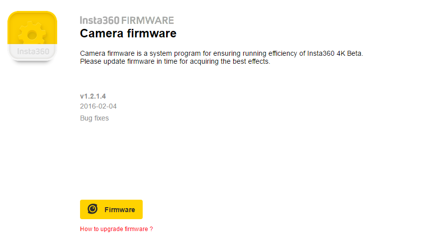
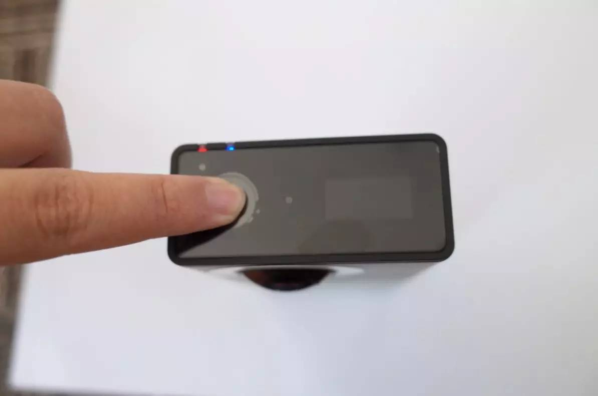
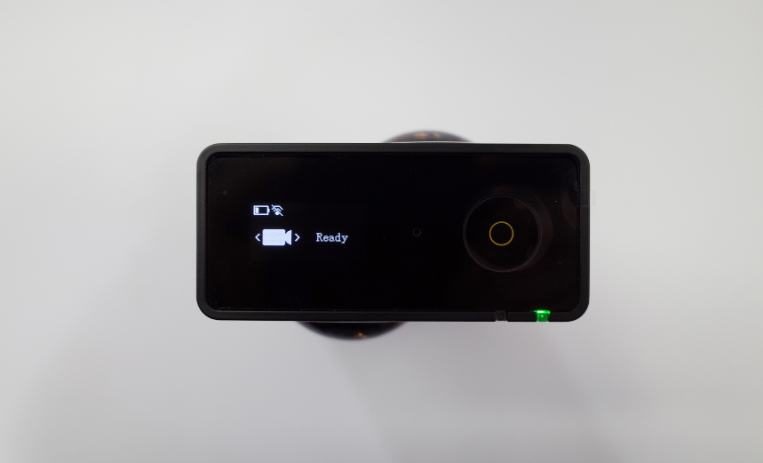
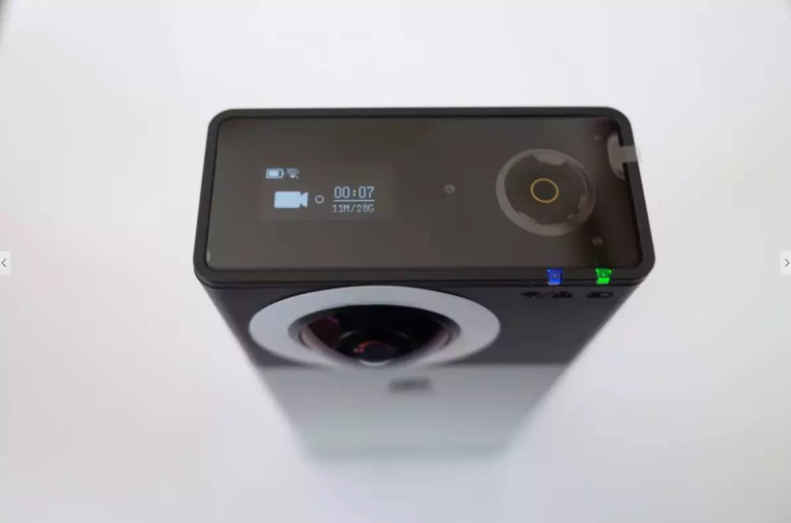
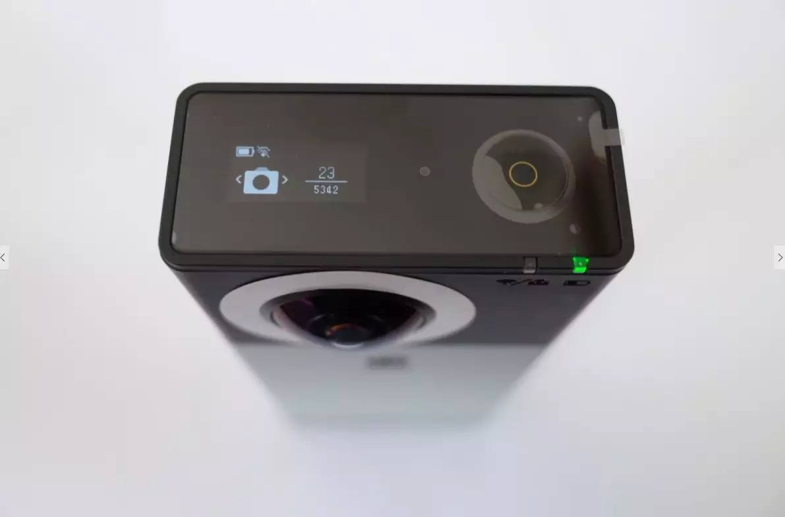
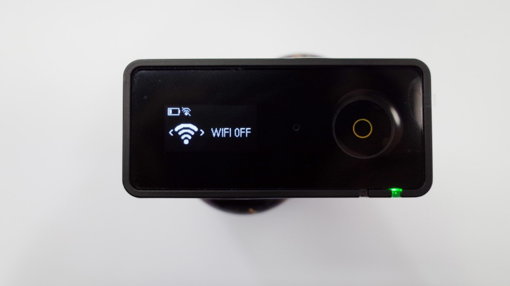
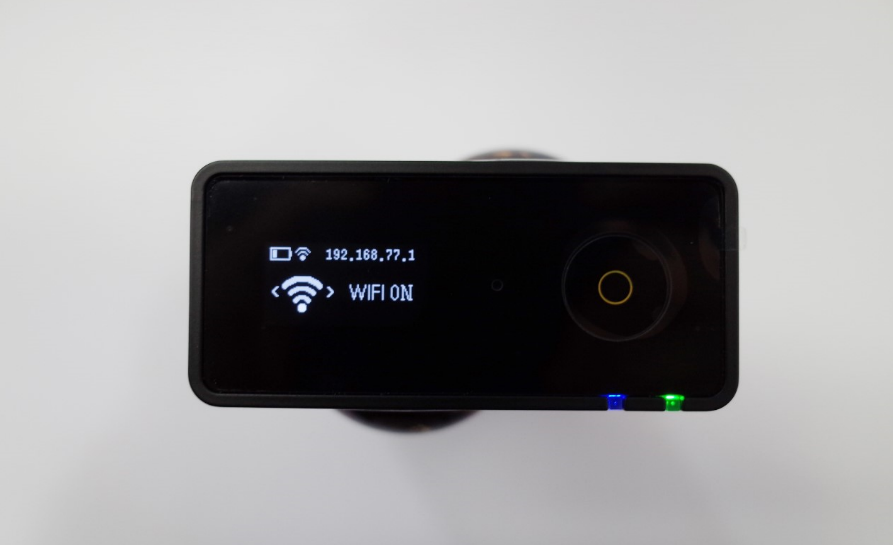
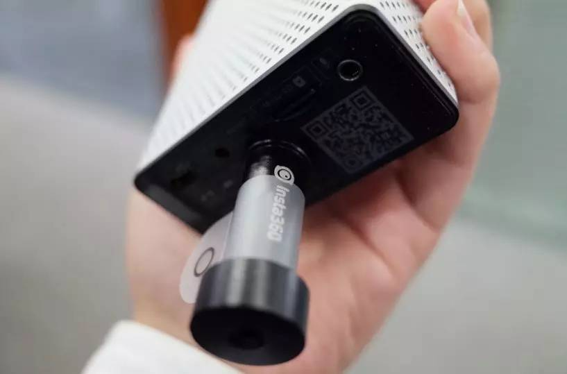
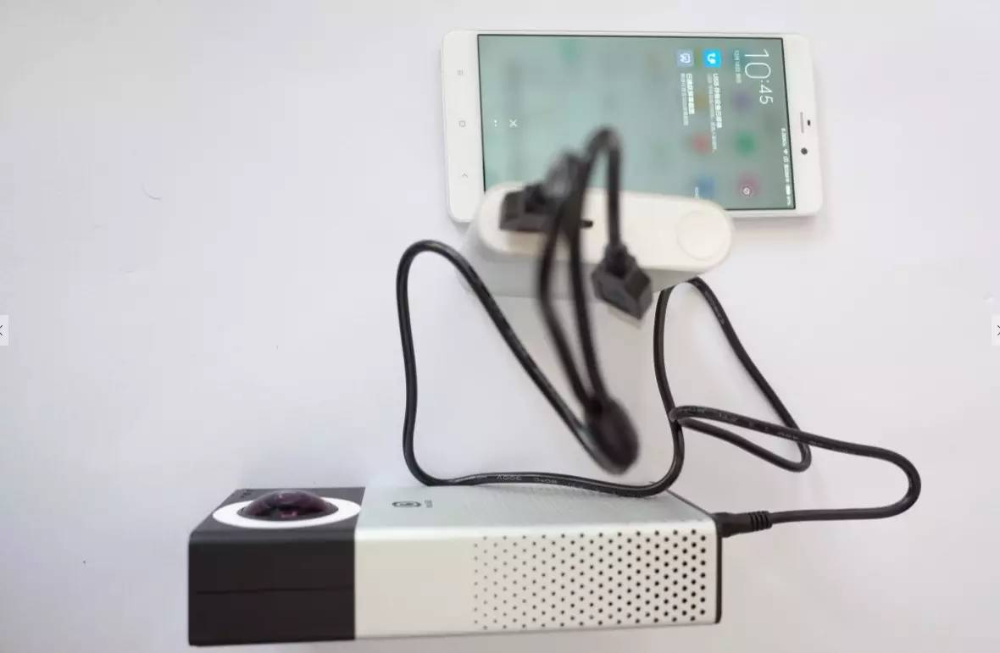
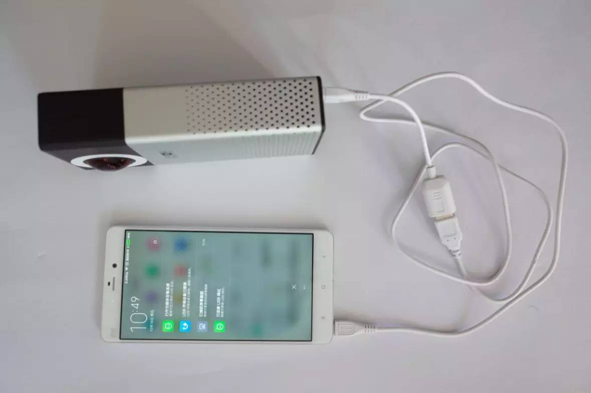

#Complete Guide to Insta360 4K Spherical Camera#

##Install the latest firmware##

<http://www.insta360.com/download/insta360-4k>

Please download and install the latest Insta360 Firmware.



 
Connect the memory card to a computer and copy the latest firmware into the root directory of the TF card.

Insert the memory card into the camera and restart the camera. Shortly after learning “Updating the Firmware” from the screen, you will see the recording interface. Please kindly note that Insta360 Explorer should be updated in accordance with the firmware to ensure normal operation.

##Blind Shot Mode##
Blind shot means that the camera is not connected to any auxiliary real-time display devices such as a smartphone, and the recording is operated without WiFi network.

Hold down the power button for 3 seconds to start up the camera. The red and blue light will be turned on.
 

When the green light stays on and “Ready” appears on the screen, press the power button on top to start recording.
 


During video recording, blue light flashes and the duration, video file size as well as the amount of available space are displayed on screen. To stop recording, press the power button again and the blue light stays on.
 


The panoramic photo is taken when the blue light stops flashing as it takes time to sample, synthetize and process.
 

##Shooting with WIFI Network##
Insta360 4K Spherical Camera provides a well-suited mobile App Insta360 Explorer to control the camera. To achieve it, simply connect the App to the camera with WiFi network and keep the distance within 20 meters.

 

When WiFi hotspot starts, the blue light stays on and the camera’s IP will be shown on the upper right corner of the screen.

  

Please make sure the version numbers of the firmware and mobile app are matched in WiFi mode. The default WiFi password is Insta360 – the first letter should be capitalized.
(Please find Instructions on Insta360 4K Mobile App - Insta360 Explorer and Insta360 Player for more tips.)

##Accessories##
Insta360 4K provides a variety of practical accessories. Here are some instructions.

**1/4 Screw Adapter**

This gadget is compatible with any camera brackets, the device that prevents the bottom of the camera from abrasion, which facilitate personalized design of accessories.


**USB to DC Charging Cable**
The cable is used for connecting camera to the portable battery, which charges and keeps the camera running.

Please kindly note that the camera can be charged by two portable batteries simultaneously as it requires 3A current while the output power of portable batteries is normally 2A or 1A. The cable has two connectors to make it.

We recommend you to use Xiaomi 20000mAh power bank, featuring dual USB output ports, when you need to shoot and charge at the same time.
 


**USB OTG Adapter Cable / Micro USB Data Cable**
Camera files can be read on smartphones or tablets using two cables. Please note that OTG cable should be connected to the smartphone to ensure normal operation.
 

If OTG cable is connected to the camera, the latter will works as a power bank for the smartphone.
 

**Lens Correction Sticker**
It is for improving collage results. Paste the white sticker at the edge of the lens and store the camera in an open and good-light location. Click “automatic calibration” on “settings” page, the camera will calibrate the lens automatically.


##Reminders##
1.	The camera is a precision instrument. Please do not drop or beat your camera.

2.	The camera is not waterproof. Please keep it and the accessories dry.


3.	Please use standard cloth to keep the lens clean; make sure not to touch it with your hands. To avoid abrasion, please do not place the camera on rough surfaces.

4.	The camera can normally be fully charged within 3 hours using a standard power adapter. When not in use for a long period of time, the camera must be preserved at a dry and photophobic location. 

##Tips for Panoramic Photography##
1.	A tripod is recommended to keep the camera fixed for creating a planetary panorama in an open environment.

2.	Make sure there is sufficient light when you shoot. Try manual exposure mode in tricky light situations.

3.	Please keep the camera horizontal to acquire better image quality.

4.	An assistive device would help maintain picture stability when you shoot in movement status.


