#Losslessly Import Raw Material to AE/PR with Miraculous Plugin#

Insta360 Plugin can be used in Adobe PR, AE and help importing the lossless video into editing software after installation. 

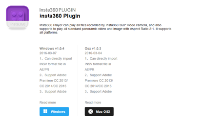
 
##Installation tricks##
###MAC Osx system###
 
Step 1: Download the plugin from the official website and then decompress the file 

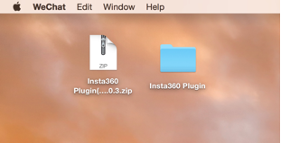 

Step 2: Select the file based on the version of the software to decompress.
 
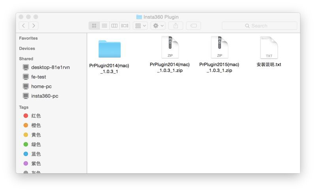
Step 3: Copy the selected and paste it on the clipboard 

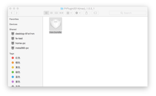 

Step 4: Choose the "Go" folder 

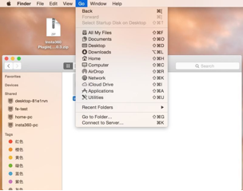
Step 5: Copy the path in the Installation Instruction 

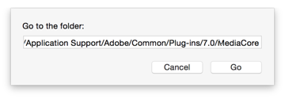
 
Step 6: Put the file into the selected folder 
 
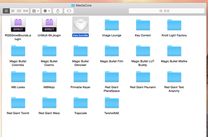
Step 7: Open AE or PR and then import the insv file directly into it

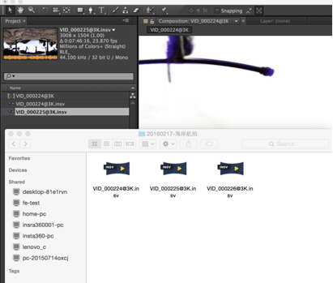
Step 8: Start editing 

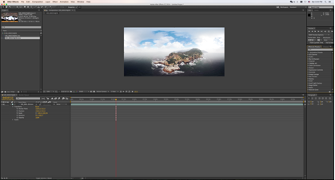
###Windows system###
Step 1: Decompress the file and install the application according to the version of your software 
 
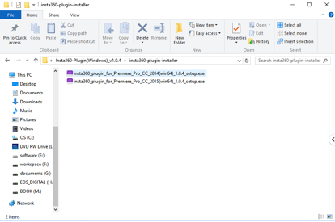
Step 2: Double click “Install”, and click “Next” without changing the default setting
  
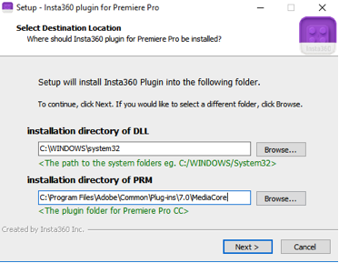
Step 3: After installation completed, open AE or PR, then import the insv file and start editing,  

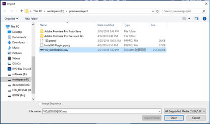 

Step 4: If the insv material is accessible on the list after being exported, then it can be edited directly, 
 
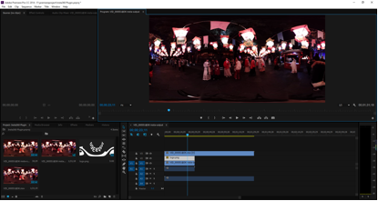
Tips: If the installed PR is of the green version, then users only need to copy insv.prm from the plugin installation folder and paste it to Plug-ins\Common under plugin folder for PR. 

