*Contains Sky Beautification Tips*

##Insta360 Player##

Insta360 provides users with Insta360 Player, a PC spherical video player, which allows the spherical videos and pictures to be viewed on computers. Simply drag them to the playback window. Insv, insp, mp4, jpg files are currently accepted.
 
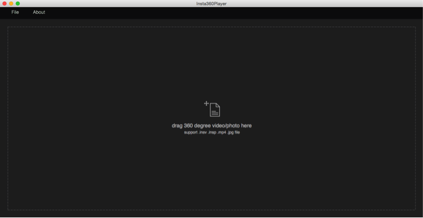

Drag your mouse to view the spherical video from different angles and you can experience a reversed world by just one click.
  
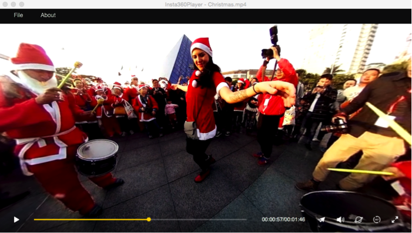
 
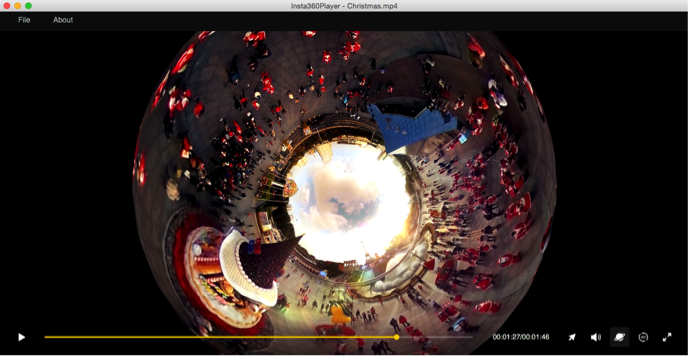

To experience the most stunning spherical landscape, view it in “little planet” mode.
 

 

##Insta360 Studio##

Insta360 Studio possesses the same spherical playing function as Insta360 Player, with an advantage on postproduction and sharing platform.

##Export##

Spherical pictures and videos can be played and edited by Insta360 Studio, which would export the original insv video and insp picture to MP4 and JPG format respectively. The aspect ratio of the exported pictures and videos is 2:1.


 
- Type 1: Superb (slow output, good quality)
- Type 2: Internet output, fixed rate at 8M (the software will ask whether submit to the cloud broadcast platform)
- Type 3: Medium
- Type 4:Ultra fast
 
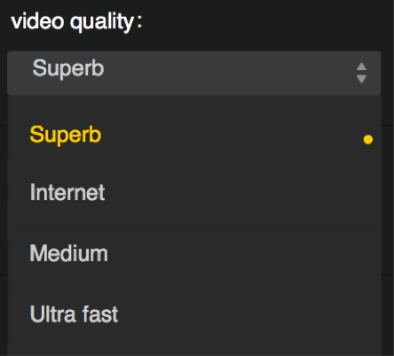
 
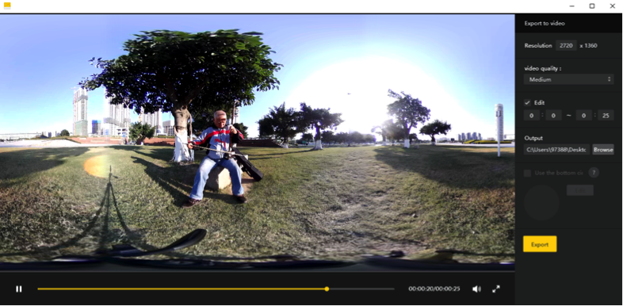

##Editing##

You can edit the video before exporting it. The video cut can be accurate to one second.


 
##Add Logo##

You can add logo in the video to convey information.

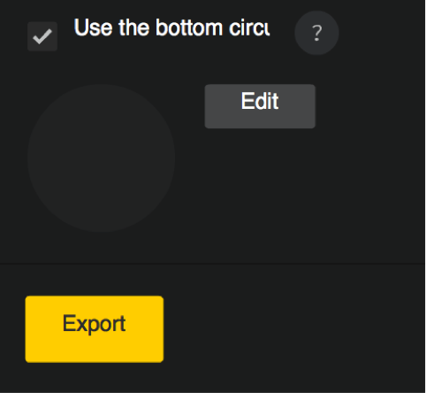


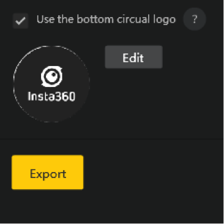

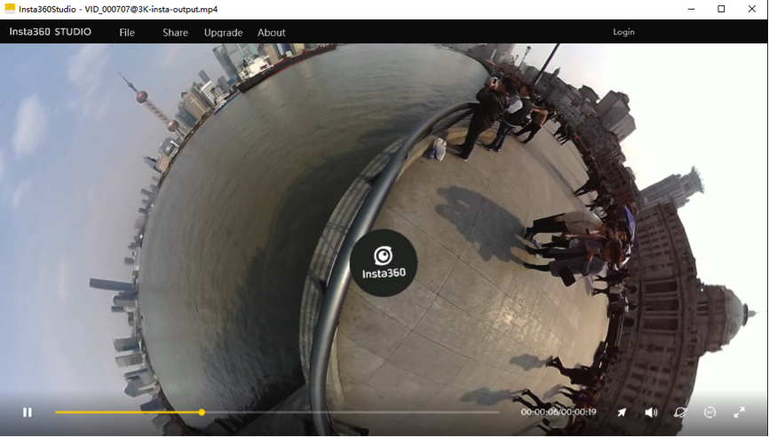
 
Please note that the logo is suggested to be in jpg or png format and its diameter should exceed 500px.


##Export to jpg images##

Export insp images to jpg format.



When transcoding is finished, mp4 file can be opened in the editing software and edited as normal videos. After that, still have the file exported and saved as mp4 format and you will be able to watch the spherical picture in spherical video players.

Add titles, credits and watermarks in your video, plus favorable music and color rendering – a stunning spherical film is done!

Here is a simple and practical tip.

##Sky Beautification Tip##

When getting aerial shots, the spherical camera may capture aircrafts, making the sky not very nice in the picture. In such cases, we need to cover aircrafts to beautify the sky. The tip can be also be used for pictures taken on overcast days.

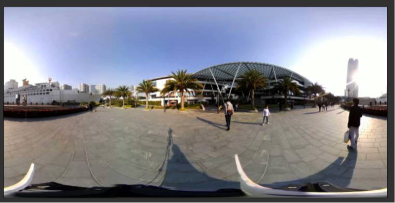
 
 *Although the sky is blue in this picture, it will be more beautiful if there are clouds.*

Open a new project in AE (Adobe After Effects CC2014) and add the video needs to be beautified; Choose a sky material, either picture or video, and place it onto the video you would like to beautify.
 
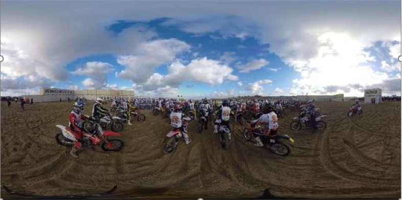

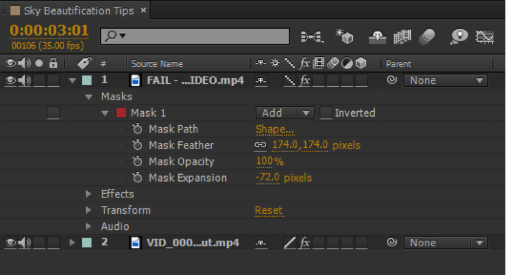
  
*The sky material is FAIL-...DEO.mp4 and the original video is VID_000...ut.mp4*

Use mask and pen tool to sketch the selected material. Keep the sky only.
 
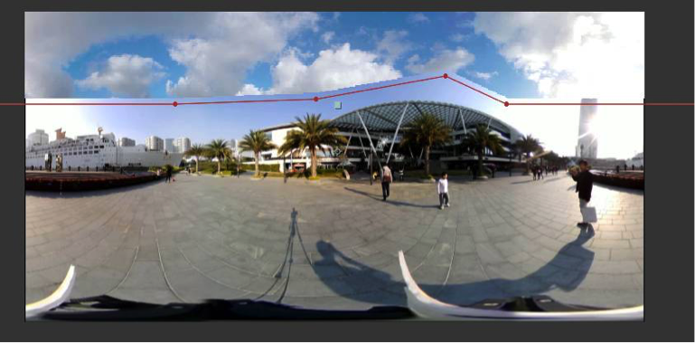

Adjust feather and mask to reach a natural transition from the sky of the original video to that of the material. Please kindly note that the mask should be enlarged moderately in order not to feather the surrounding materials.

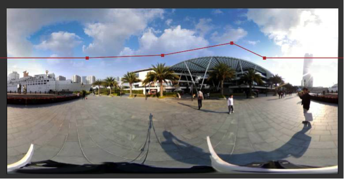
 
To make the sky color more natural, we could also adjust “Effect > Color Calibration > Curves or Hue/Saturation”
 
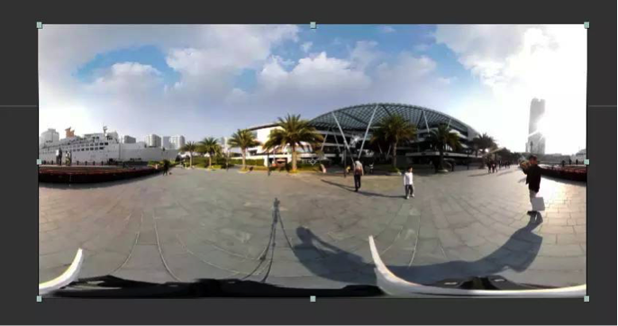

Thus the sky beautification is completed! Perfect!

As long as the sky is wide and has no complex obstructions, this method can be implemented. Try it!

Many other video postproduction software, such as Final Cut Pro on Mac, can do it too. Explore more means!

Please also pay attention to our future fun and practical guides on spherical shooting and postproduction.

