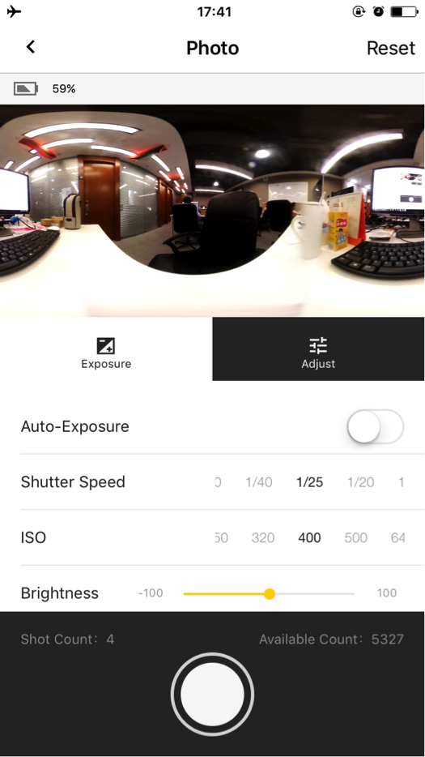
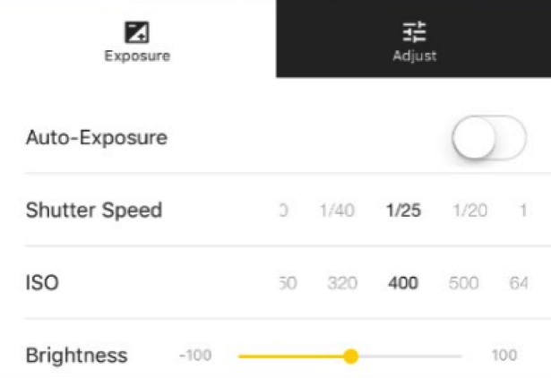
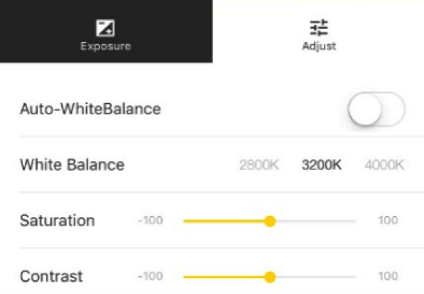
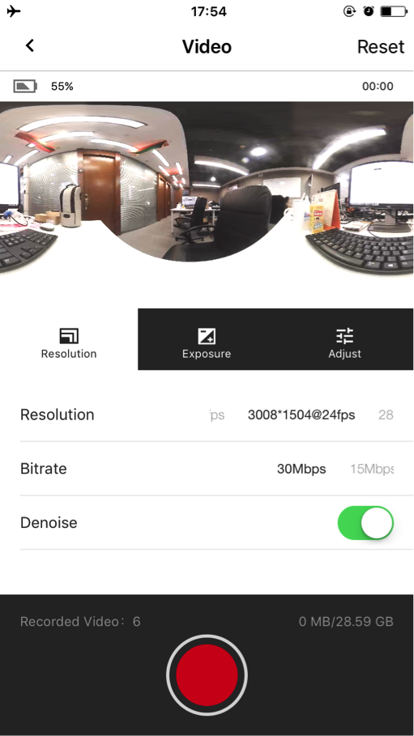
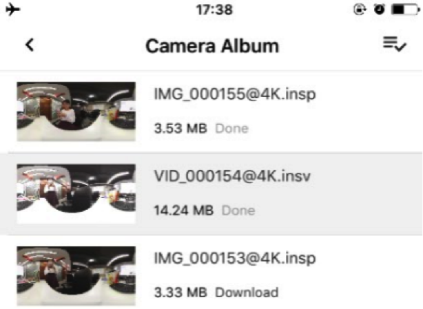
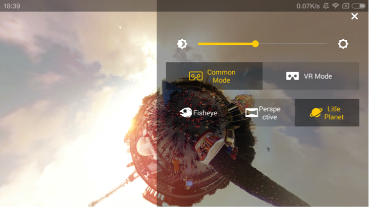
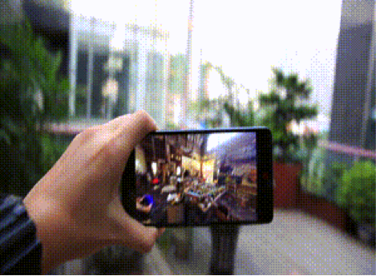
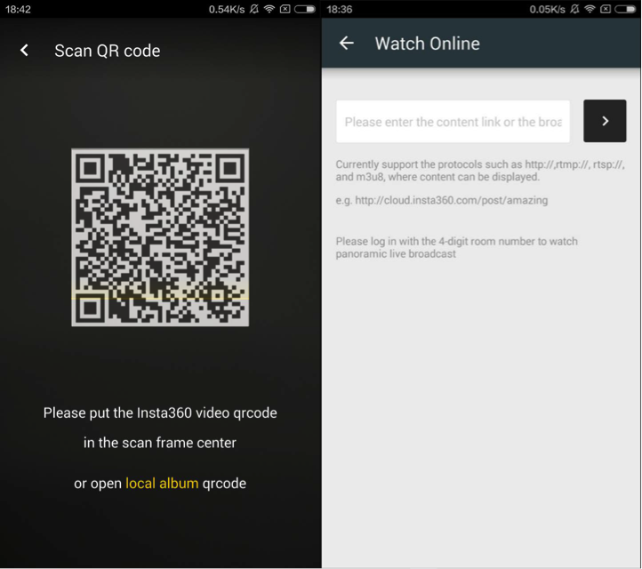

Both the firmware and the app of the camera will be updated once a week. Please download the latest version for better experience.

##Insta360 Explorer##

Once you run Insta360 Explorer you will see 4 columns, Photo, Video, Camera Album and Local Album, as well as the Settings option.


 
**Photo:**
The photo interface has real-time preview for the picture, battery display in the upper-left corner, the number of pictures taken and photographs you can still shoot before the memory wears out at the bottom.
 

In the function menu of the camera, you have 2 exposure modes, auto exposure and manual exposure, and you can also adjust the white balance, brightness, saturation and contrast. 

The adjustment for shutter speed has been upgraded within the range of 1/20s to 1/5000s and ISO within the range of 100 to 6400. 
 

The 7 white balance modes include tungsten, fluorescent, sunlight, bright, daylight and flashlight. The brightness, saturation and contrast can be adjusted within the range of 100.
 

After you press the SHOT button, the camera starts to take photograph with a few seconds of delay, and you can take the next picture when the previous one is saved.

**Video:**
The video interface shows the number of videos taken and the storage space available. In addition to the same functions of camera which include manual exposure, auto exposure, adjustments of white balance, brightness, saturation and contrast, it also supports 6 different resolutions for video recording. 

 

The mobile app now can provide real-time preview prior to the recording. You can also touch the screen to turn off the preview to save power, but it will be resumed after the recording. 


 
**Settings:**
In the settings interface, you can check the app version and the device firmware version, and change the Wi-Fi password for this camera. 


 
**Camera Album:**
In the camera album, you can view the files saved in the TF card (files with the extension of “.insv” for video and “.insp” for image). You can also download the files and save them in the local album. 


  
**Local Album:**
It is worth noting that the local album is stored in the location, “Insta360>cache”, in your phone.
 


##Insta360Player##



Both Insta360 Player and Insta360 Explorer support spherical video. However, Insta360 Player, different from Insta360Explorer, supports spherical video of insv, insp, mp4 and jpg format; it also supports 3 play modes, which are Multi-touch Slide Watching (Fisheye, Perspective and Little Planet), G-Sensor (gyroscope), VR Mode (VR glasses required).


Multi-touch Slide Watching


G-Sensor


VR Watching


In the Insta360 Player homepage, spherical videos and pictures stored under the folder “Player” in your phone are played automatically. Besides, Insta360 Player plays the online videos by scanning the QR code in the cloud system or typing the address, which allows better image quality and diverse watching modes.


 


