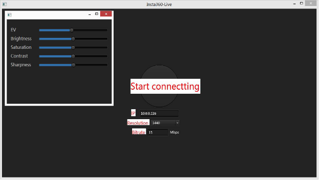
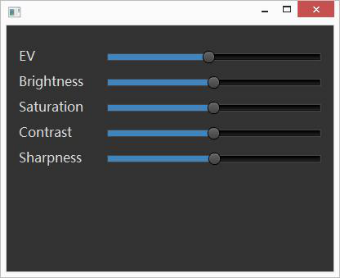
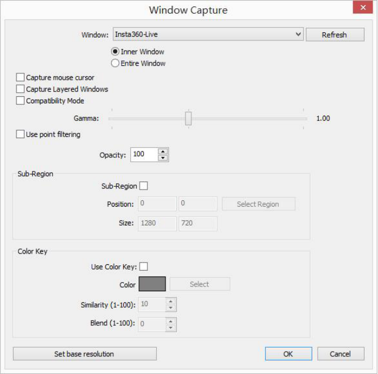
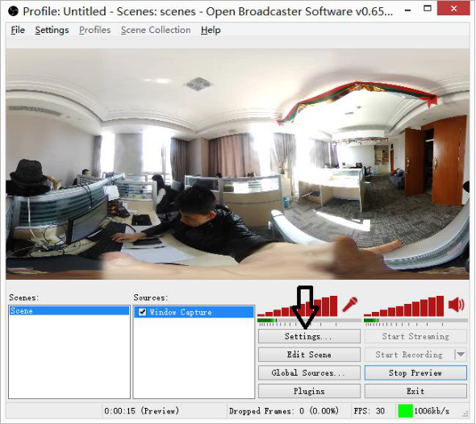
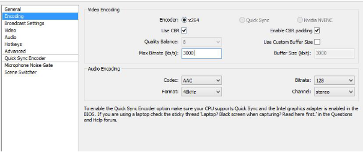
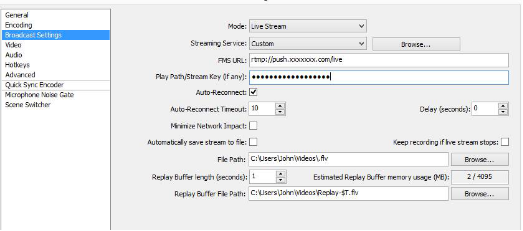
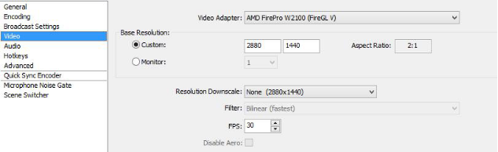
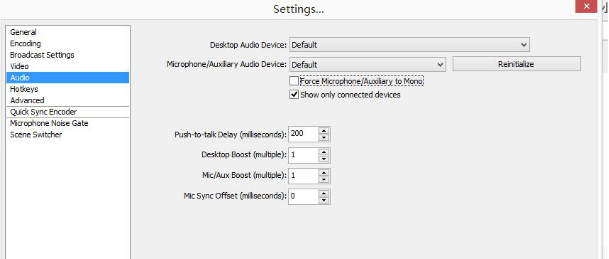

Steps to live streaming using Insta360 4K   
*During testing period, you can apply for live streaming service. 

## 1.Device Connection 

Connect your laptop or computer to router via network cable; then connect 
the camera with the USB network card via OTG cable; and at last connect the
USB network card with router via network cable. 

Network card of Rj45 AX88772B is recommended  
IP address will be displayed when successfully connected.   

**Caution: Keep camera WIFI off during live streaming. **

***

## 2.Image Input 

Open LiveKit software, enter the displayed IP address, and set resolution 
and bitrate (Default: 1440&15Mbps). 

Click CONNECT. Once successfully connected, LiveKit will display 
real-time image.   

Default image automatic-rotation function can be turned off/on via Ctrl+R。

Press the SPACE key can switch live image to expanded 2880*1440 
image.  

Exposure white balance and other parameters can be adjusted as demand.   

***

## 3. Push Video Streaming Online   

Display the LiveKit image in OBS software. 
Right click source window → Add → Capture window. Then choose 
Insta360-live in the WINDOW option. 

Click SETTINGS after image is captured. 

Set encoding bitrate in the ENCODING menu bar. 

Enter the required format and address in the BROADCAST setting. 

Choose 2880*1440 ratio in VIDEO setting. 

Select Audio. You are allowed to choose audio device freely.     

Click OK or Streaming to live broadcast.     

***

## 4.Notice 

- a.  Please do not minimize or maxmize Insta360-live when live
broadcasting 
- b.  You can right click the image and select SmartScale in the Position/Size 
option to choose the suitable image size. 
- c.  For customers who test Insta360 live, we can inform you the stream 
address during test period.   

> USB2.0 is recommended
> 
> Recommended external network card：Rj45 AX88772B 

# 5.Required equipment   

- Insta360 Spherical Camera * 1 
- Laptop/Computer * 1 (with i5 processor or higher performance) 
- Router * 1 
- USB network card * 1 
- OTG cable * 1 
- Internet cable * 3 (or more) 
- LiveKit and OBS software (Need to be downloaded in advance) 

## 6.Related Resources 

-  [LiveKit 1.2.0](http://resource-insta360.oss-cn-hangzhou.aliyuncs.com/software%2FLiveKit%2FLiveKit%201.2.0.zip)   
- [Open Broadcaster Software](https://obsproject.com/download)