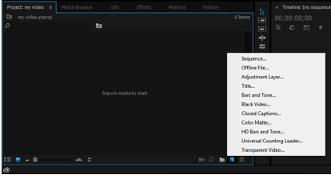

##Editing only takes three minutes##
 
In order to familiarize users with panoramic video editing in a short time, Insta360 has launched a series of basic level video tutorial designated for the most popular video editing software currently available in the market. 

For more related tutorials, please leave a comment on our official Wechat account where more tutorials will be released from time to time.  

If the video shot by Insta360 requires no major alterations, it would be recommendable for users to employ Studio, the bundled editing software to edit the raw material as it can cut down the exporting time considerably. The customized logo at the bottom will ensure the protection of video copyright. 

##A beginner tutorial shows you how to edit a 360-degree video##

**Step 01:** Open Adobe Premiere Pro CC 2014, create a new project, select the intended location and title of the project before clicking OK.


 
**Step 02:** After the new project is created, there are ways to create new sequence. 

**No.1**

1. The first is to click the New Item icon on the bottom right corner of the Project Pane and then select “Sequence”

	

	

2. Select “Settings” on the top of the pop-up window, then select“Custom” in the “Editing Mode” 

	

3. Select “Square Pixels (1.0)”in “Pixel Aspect Ratio”, then type in the size and frame rate of the video correspondingly on the “Frame Size” and “Time Base”. ```A 2K video is 2720*1360  30FPS, a 3K video is 3008*1504  23.76FPS and a 4K video is 4096*2048  15FPS.``` Noted that the aspect ratio of a panoramic video is 2:1. After that, click OK to confirm the creation of the new sequence. 

	

**NO.2**

1.	The second method is to right-click on the Project Pane and select “Import”, and then the material will be imported into the application. ( please remember to install our Insta360 Plugin in order to allow Premiere to directly edit the material of its native format)

	
	
2. To allow the new sequence to adapt to size of the video, drag the imported material to the“New Item” icon which is located at the right bottom corner of the Project Pane, then click OK to confirm the establishment of the new sequence. 

	
 
**Step 03:** After successfully complete the first two steps, the video will be able to be edited like a conventional video on the Timeline (The functionality, such as Color Correction, Add Music and Special Effect are readily accessible, and Insta360 will update its tutorials series specifically on those aspects) 


**Step 04:** To export the edited video, click “File”, then select “Export”. 


 
**Step 05:** Click “Format“on the pop-up window then select “H. 264”, please be noted that MP4 is recommended, then click “Export” at right bottom corner and finish editing.  


 
Apart from maintaining the aspect ratio of 2:1 during editing a panoramic video, the rest of the operations basically are no different from a conventional video editing. Plus, a panoramic video does not require Cropping and too many Transitions as long as the picture stays in one place. 

Is it much simpler than what you have in mind about video editing? Let’s go and have some fun!

