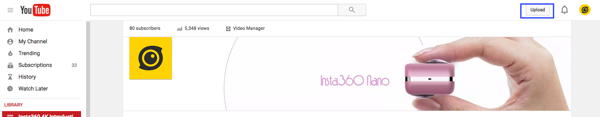
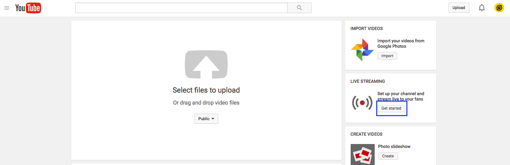
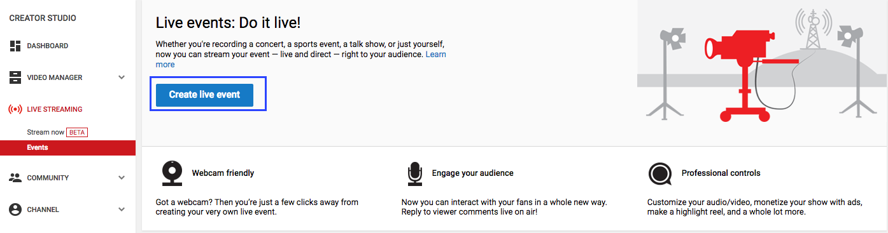
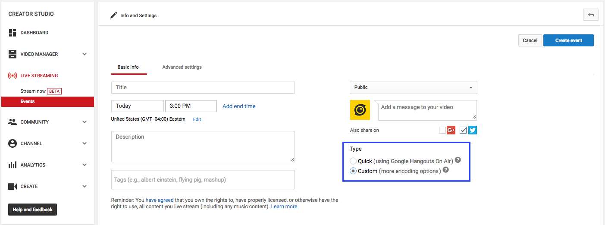
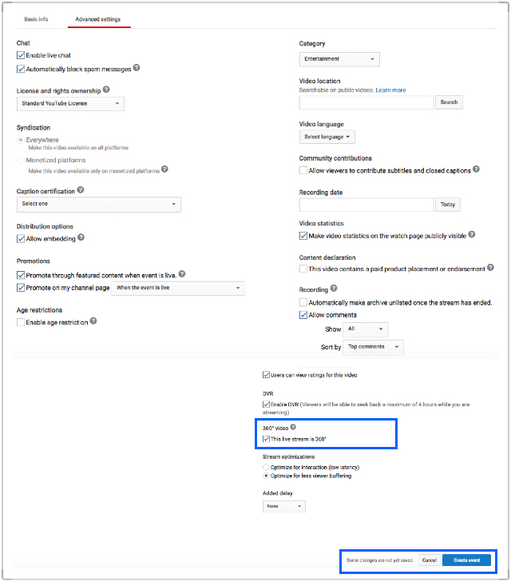
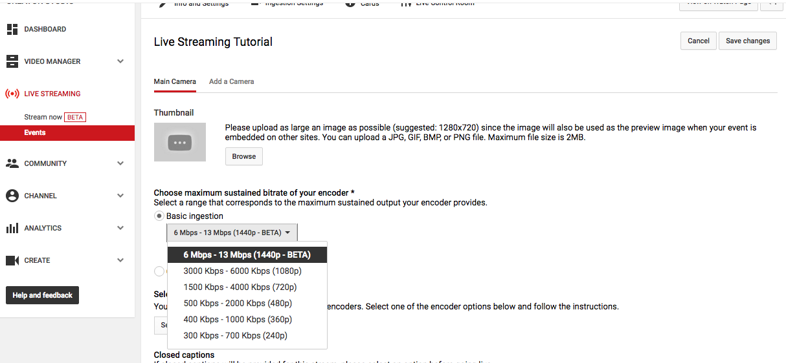
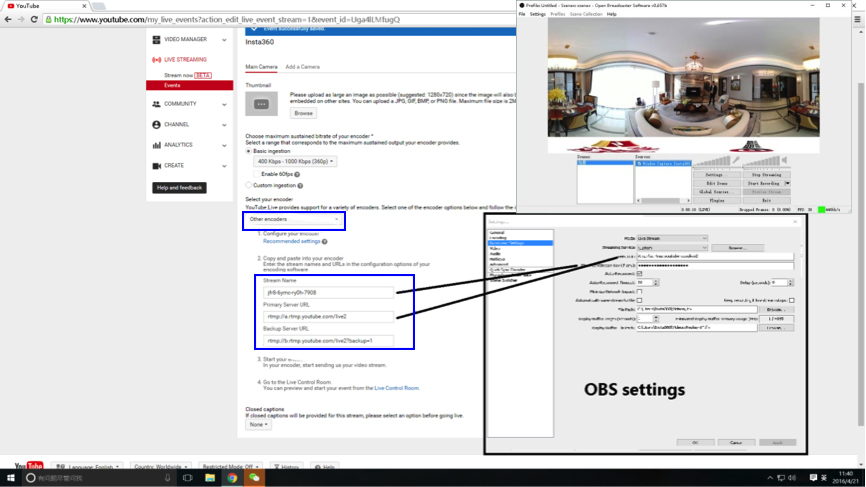
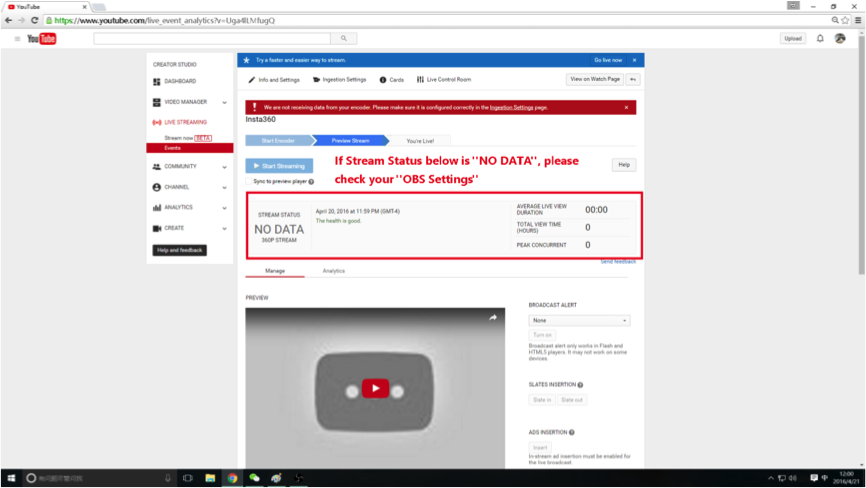
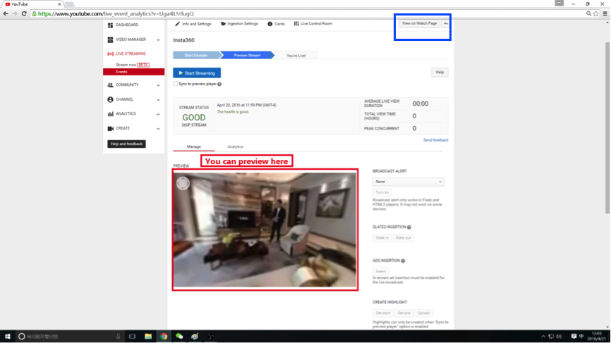

**Step01**  Login with your Google account, and click UPLOAD.

 
**Step02** Click GET STARTED in the Live Streaming box.

**Step03** Select EVENT -> NEW LIVE EVENT. You need to enable the function by simply clicking the ENABLE tab if it is the first time for you to broadcast.

 

**Step04** Select CUSTOM.

**Step05** Select THIS LIVE STREAM IS 360 in the ADVANCED SETTINGS tab. Then Click CREATE EVENT.

**Step06** In the BASIC INGESTION, select the needed bitrate and resolution.

**Step07** Open your OBS, go to SETTINGS -> BROADCAST SETTINGS

  

**Step08** 

 

**Step09**

 

**Step10** Click VIEW ON WATCH PAGE to enjoy your streaming.
 

 