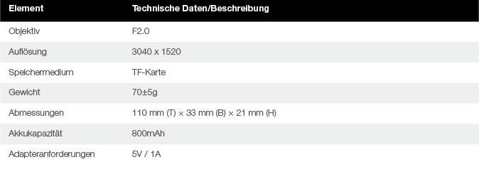
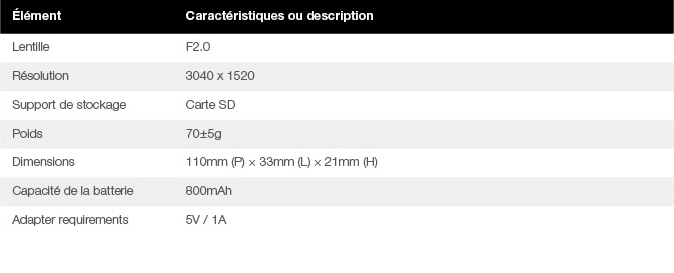
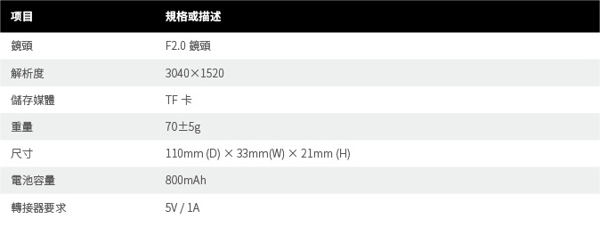

## Manual(English)

  

1 camera Overview  

1.1 Component Overview  

  
  	

1.2 Specifications  

  

1.3 Accessories  

  

2 Basic Fuctions  

2.1 Install TF card  

Please follow the instructions as shown:Insert the TF card horizontally into the slot,The camera will not work untill the TF card is properly installed.  

Please insert the TF card according to the direction printed on the camera.  

    

***Tips:Support Class10 and above，exFAT/FAT32 format,up to 64GB.**

2.2 Indicator  

The LED indicator light shows the camera's power states and working status.  

  

2.3 Charging and Power  

Use power adapter of iPhone6/6s series(5V/1A),and connect to the Micro USB charging port to charge Insta360 Nano,When fully charged,the red light goes off.  
  
Connect Insta360 Nano to iPhone as shown to start the camera(*Note:connecting to your iPhone while charging will not start the camera),The camera will enter the standby mode when the blue indicator light turns green.  

  

The camera will be automatically turned off when unplugged from iPhone.  

2.4 Reset  

If the camera becomes unresponsive,you can use an eject pin to poke the reset pinhole,or long press the power button over 15 seconds to reset the camera.The indicator light will go off if successfully reset.  

  

2.5 Data Transmission  

You can transfer files from the camera to your computer with a Micro USB cable. 
 
  

2.6 Independent Use  

With TF card installed,the camera can be used independently to take photos and videos.  

In the standby mode,click the power button to take a photo,and the green light blinks one time.  

In the standby mode,double click the power button to shoot a video.The green light keeps blinking during video recording,and you can stop by clicking the power button again.  

Once the photos and videos are finished,they will be stored in the TF card,You can connect to your iPhone to review them.  

    

***Tips:In order to save power, the camera will be automatically turned off without operation over 5 minutes when used independently.**

3 Mobile App  

Insta360 Nano with its App togerther provides you with a better shooting experience.At the first connection,you can follow the instructions to download the App,or visit [http://www.insta360.com/download/insta360-nano](http://www.insta360.com/download/insta360-nano).  

  

System requirements for iPhone:iOS 8.1 and above(supports iPhone 6,iPhone 6 Plus,iPhone 6s and iPhone 6s Plus).  

  

4 Firmware Upgrade  

Please find the latest firmware package and perform upgrade with the App.  

  

5 Notices  

Please read the following simple instrutions carefully.Any failure to follow these instrutions may result in danger or law violations.This manual provides safety information.Please pay attention to safety tips and maintenance when trying out the camera.The company will not be responsible for any damages caused by improper usage and demolition or failure to follow the instructions of this manual.  

5.0.1 Users terms and privacy policy  

Please visit [http://help.insta360.com/help/service.insta360-Nano/](http://help.insta360.com/help/service.insta360-Nano/)to find out the user terms and privacy policy related to Insta360 Nano.  

5.0.2 Proper way of charging  

Please use the original iPhone adapter to charge your camera.The camera will be fully charged in about 2 hours when power down.  

5.0.3 Maintenance of the battery  

In order to prolong the life span of the battery,please keep the battery capacity at a level between 50% and 80%,and keep it powered off and stored in a dry place,avoiding direct sunlight.Please note that if a fully charged battery is left unused for a long time,it will gradually discharge automatically which is bad for the battery.it is recommended that the unused period should not be longer than one month,or make a full charge once every month if it has to.This will help prolong the life span of the battery.  

5.0.4 Please keep the camera away from children and pets  

If children or pets accidentally drop the camera or damage the camera,the fine mechanics inside the camera may be damaged,and the children and pets may get injured.  

5.0.5 Protect your lens  

Please keep the camera inside the pouch if it is not in use.Randomly placing the camera or having the lens in touch with table or other unever surface may affect shooting quality.While using the camera,do not touch the lens with your hands.You should clean both lenses periodically by wiping them clockwise with the cleaning cloth.While using the camera,please do not place your camera directly on top of a rough surface(such as the ground),in order to prevent damages to the lenses.  

5.0.6 Do not drop or knock your camera  

While using the camera,please take necessary precaution measures,do not drop or knock your camera,which may damage the fine mechanices inside the camera.  

5.0.7 Protect your camera against water,direct sunlight and damp  

The camera is not waterproof,and thus you need to protect your camera against water and damp,and keep your camera and accessories dry.Please do not place your camera under direct sunlight for a long time.  

5.0.8 Turn off the camera at gas stations,or near other blasting sites  

Please follow related regulations while you are near any fuel or blasting site,in order to protect yourself and your camera.  

5.0.9  Camera instructions  

Default video recording time limit:15 minutes.  

It is normal that the camera may start to heat up slightly when in use.Please avoid using the camera in high temperature.  

Get Insta360 Player/Studio to play or edit your 360° video on PC([http://www.insta360.com/download/insta360-4k](http://www.insta360.com/download/insta360-4k)).  

## Handbuch(Deutsch)
 
  

1 Kamera – Überblick  

1.1 Komponenten – Überblick  

  

  

1.2 Technische Daten  

  

1.3 Zubehör  

  

2 Grundlegende Funktionen  

2.1 Einsetzen einer TF-Karte  

Befolgen Sie die Anweisungen wie in der Abbildung dargestellt:Setzen Sie die TF-Karte horizontal in den Steckplatz ein,Die Kamera funktioniert erst, wenn die TF-Karte ordnungsgemäß eingesetzt ist.  

Setzen Sie die TF-Karte in der an der Kamera abgebildeten Ausrichtung ein.  

    

***Hinweise:Unterstützt SD-Karten ab Class 10 mit bis zu 64 GB für die Formate exFAT/FAT32.**

2.2 Anzeige  

Die LED-Anzeige zeigt den Stromversorgungsund Arbeitsstatus der Kamera an.  

  

2.3 Aufladen und Ladestatus  

Verwenden Sie für die Aufladung der Insta360 Nano ein Netzteil der Serie iPhone6/6s (5 V/1 A), das Sie an den Micro-USB-Ladeanschluss anschließen,Wenn die Kamera vollständig aufgeladen ist, erlischt die rote LED.  
  
Schließen Sie die Insta360 Nano wie in der Abbildung dargestellt an ein iPhone an, um die Kamera zu starten. (*Hinweis: Wenn Sie die Kamera während der Aufladung an ein iPhone anschließen, wird diese nicht gestartet.) Die Kamera wechselt in den Standby-Modus, wenn die LED von Blau zu Grün wechselt.  

  

Die Kamera wird automatisch ausgeschaltet, wenn sie vom iPhone getrennt wird.  

2.4 Zurücksetzen  

Wenn die Kamera nicht reagiert, können Sie mithilfe eines Auswurfsstifts den Reset-Knopf drücken oder die Ein-/Aus-Taste mehr als 15 Sekunden lang gedrückt halten, um die Kamera zurückzusetzen.Wenn die Kamera erfolgreich zurückgesetzt wurde, erlischt die Kontrollleuchte.  

  

2.5 Datenübertragung  

Mithilfe eines Micro-USB-Kabels können Sie Dateien von der Kamera auf Ihren Computer übertragen. 
 
  

2.6 Separate Verwendung  

Wenn eine TF-Karte eingesetzt ist, kann die Kamera separat zum Aufnehmen von Fotos und Videos verwendet werden.  

Drücken Sie im Standby-Modus die Ein-/Aus-Taste, um ein Foto aufzunehmen. Die grüne LED blinkt dann einmal.  

Drücken Sie im Standby-Modus zweimal die Ein-/Aus-Taste, um ein Video aufzunehmen.Die grüne LED blinkt durchgehend während der Videoaufnahme. Sie können diese anhalten, indem Sie erneut die Ein-/Aus-Taste drücken.  

Nach der Aufnahme werden die Fotos bzw. Videos auf der TF-Karte gespeichert,Sie können sich diese ansehen, indem Sie die Kamera an Ihr iPhone anschließen.  

     

***Hinweise:Wenn die Kamera separat verwendet wird, wird sie nach 5 Minuten ohne Aktivität automatisch ausgeschaltet, um Strom zu sparen.**

3 Mobile App  

Die Insta360 Nano bietet Ihnen in Kombination mit der zugehörigen App ein optimiertes Aufnahmeerlebnis.Wenn Sie die Kamera zum ersten Mal anschließen, befolgen Sie die Anweisungen zum Herunterladen der App oder besuchen Sie die Website unter [http://www.insta360.com/download/insta360-nano](http://www.insta360.com/download/insta360-nano).  

  

Systemanforderungen für iPhone: iOS 8.1 und höher (unterstützt iPhone 6, iPhone 6 Plus, iPhone 6s und iPhone 6s Plus).  

  

4 Firmware-Upgrade  

Suchen Sie nach dem neuesten Firmware-Paket und führen Sie mithilfe der App ein Upgrade durch.  

  

5 Hinweise  

Bitte lesen Sie die folgenden einfachen Anweisungen genau.Eine Missachtung dieser Anweisungen kann Gefahren nach sich ziehen oder einen Verstoß gegen geltende Gesetze darstellen.Dieses Handbuch enthält Sicherheitsinformationen.Lesen Sie sorgfältig die Sicherheitshinweise und Informationen zur Wartung, bevor Sie die ersten Schritte mit der Kamera durchführen.Das Unternehmen übernimmt keine Haftung für Schäden, die durch eine unsachgemäße Bedienung und Beschädigung oder eine Missachtung der in diesem Handbuch enthaltenen Anweisungen verursacht wurden.  

5.0.1 Nutzungsbedingungen und Datenschutzrichtlinie  

Die Nutzungsbedingungen und Datenschutzrichtlinie für die Insta360 Nano finden Sie unter [http://help.insta360.com/help/service.insta360-Nano/](http://help.insta360.com/help/service.insta360-Nano/).  

5.0.2 Ordnungsgemäßes Aufladen  

Verwenden Sie den originalen iPhone-Adapter zum Aufladen Ihrer Kamera.Die Kamera ist im ausgeschalteten Zustand nach ca. 2 Stunden vollständig aufgeladen.  

5.0.3 Warten des Akkus  

Um die Lebensdauer des Akkus zu verlängern, sorgen Sie dafür, dass die Akkukapazität zwischen 50 % und 80 % beträgt und bewahren Sie ihn an einem trockenen Ort ohne direkte Sonneneinstrahlung auf, wenn dieser ausgeschaltet ist.Beachten Sie, dass sich ein Akku automatisch allmählich entleert, wenn ein vollständig aufgeladener Akku über einen längeren Zeitraum nicht verwendet wird. Dies kann die Akkuleistung beeinträchtigen.Es wird empfohlen, den Akku nicht länger als einen Monat unbenutzt zu lassen oder ggf. einmal im Monat eine vollständige Aufladung durchzuführen.Dies verlängert die Lebensdauer des Akkus.  

5.0.4 Schutz von Kindern und Tieren  

Sollten Kinder oder Tiere die Kamera versehentlich fallen lassen oder beschädigen, kann die empfindliche Mechanik im Inneren der Kamera beschädigt werden; hierbei besteht Verletzungsgefahr bei Kindern und Tieren.  

5.0.5 Schutz Ihres Objektivs  

Bewahren Sie die Kamera in der Tasche auf, wenn sie nicht verwendet wird.Wenn Sie die Kamera oder das Objektiv willkürlich auf den Tisch oder eine andere unebene Fläche legen oder damit in Berührung kommt, kann die Aufnahmequalität beeinträchtigt werden.Berühren Sie das Objektiv nicht mit Ihren Händen, wenn Sie die Kamera verwenden.Sie sollten beide Objektive regelmäßig reinigen, indem Sie sie mit dem Reinigungstuch in einer drehenden im Uhrzeigersinn verlaufenden Bewegung abwischen.Legen Sie Ihre Kamera während der Verwendung nicht direkt auf eine raue Oberfläche (wie etwa auf den Boden), um eine Beschädigung der Objektive zu vermeiden.  

5.0.6 Schutz vor Fallenlassen oder Stößen der Kamera  

Treffen Sie bei der Verwendung der Kamera die erforderlichen Sicherheitsmaßnahmen, um die Kamera nicht fallen zu lassen oder Stößen auszusetzen, da hierdurch die empfindliche Mechanik im Inneren der Kamera beschädigt werden könnte.  

5.0.7 Schutz der Kamera vor Wasser, direkter Sonneneinstrahlung und Feuchtigkeit  

Die Kamera ist nicht wasserdicht. Deshalb müssen Sie Ihre Kamera vor Wasser und Feuchtigkeit schützen und Kamera und Zubehör trocken halten.Setzen Sie die Kamera nicht über einen längeren Zeitraum direkter Sonneneinstrahlung aus.  

5.0.8 Ausschalten der Kamera an Tankstellen oder in der Nähe von anderen explosionsgefährdeten Standorten  

Wenn Sie sich in der Nähe von Standorten, an denen sich Brennstoff befindet oder Explosionsgefahr besteht, aufhalten, befolgen Sie zu Ihrem Schutz und zum Schutz der Kamera die relevanten Vorschriften.  

5.0.9  Hinweise zur Kamera  

Die maximale Videoaufnahmezeit beträgt standardmäßig:15 Minuten.  

Wenn sich die Kamera während der Verwendung leicht erwärmt, ist dies ein normales Verhalten.Verwenden Sie die Kamera nicht bei hohen Temperaturen.  

Laden Sie zur Bearbeitung Ihres 360°-Videos auf dem PC Insta360 Player/Studio herunter([http://www.insta360.com/download/insta360-4k](http://www.insta360.com/download/insta360-4k)).  

## Manuel(français)
 
  

1 Vue d'ensemble de la caméra  

1.1 Vue d'ensemble des composants  

  

  

1.2 Caractéristiques  

  

1.3 Accessoires  

  

2 Fonctions de base  

2.1 Installer la carte SD  

Suivez les instructions comme indiqué:Insérez la carte SD horizontalement dans la fente,La caméra ne fonctionnera pas tant que la carte SD n'est pas correctement installée.  

Veuillez insérer la carte SD selon la direction imprimée sur la caméra.  

    

***Conseils:Prise en charge de la Classe 10 et supérieure, format exFAT/FAT32, jusqu'à 64 Go.**

2.2 Voyant  

Le voyant LED indique l'état d'alimentation et de fonctionnement de la caméra.  

  

2.3 Charge et alimentation  

Utilisez l'adaptateur secteur pour iPhone6/6s (5 V/1 A) et connectez-le au port de charge MicroUSB pour charger votre Insta360 Nano.Lorsqu'il est complètement chargé, le voyant rouge s'allume.  
  
Connectez votre Insta360 Nano à l'iPhone comme indiqué pour démarrer la caméra (*Remarque : la connexion à votre iPhone pendant le chargement ne démarre pas la caméra). La caméra passe en mode veille lorsque le voyant bleu devient vert.  

  

La caméra s'éteint automatiquement lorsqu'elle est débranchée de l'iPhone.  

2.4 Réinitialisation  

Si la caméra ne répond plus, vous pouvez utiliser une broche d'éjection pour pousser le contact de réinitialisation, ou appuyer longuement sur le bouton d'alimentation pendant 15 secondes pour réinitialiser la caméra.Le voyant se déclenche quand la réinitialisation est réussie.  

  

2.5 Transmission de données  

Vous pouvez transférer des fichiers de la caméra à votre ordinateur via un câble MicroUSB. 
 
  

2.6 Utilisation autonome  

Avec une carte SD installée, la caméra peut être utilisée de manière autonome pour prendre des photos et des vidéos.  

En mode veille, appuyez sur le bouton d'alimentation pour prendre une photo, la lumière verte clignote une fois.  

En mode veille, appuyez deux fois sur le bouton d'alimentation pour tourner une vidéo.La lumière verte clignote pendant l'enregistrement vidéo, et vous pouvez arrêter l'enregistrement en appuyant à nouveau sur le bouton d'alimentation.  

Les photos et les vidéos seront stockées dans la carte SD,Vous pouvez connecter la caméra à votre iPhone pour les visualiser.  

    

***Conseils:Afin d'économiser de l'énergie, la caméra s'éteint automatiquement après 5 minutes d'inactivité lorsqu'elle est utilisée de façon autonome.**

3 Application mobile  

L'Insta360 Nano et son application vous offrent une meilleure expérience de prise de vue.À la première connexion, vous pouvez suivre les instructions pour télécharger l'application, ou visiter [http://www.insta360.com/download/insta360-nano](http://www.insta360.com/download/insta360-nano).  

  

Configuration requise pour iPhone : iOS 8.1 et supérieur (prise en charge de l'iPhone 6, iPhone 6 Plus, iPhone 6s et iPhone 6s Plus).  

  

4 Mise à jour du firmware  

Recherchez le dernier firmware et effectuez la mise à jour avec l'application.  

  

5 Avis  

Veuillez lire attentivement les instructions suivantes.Le non-respect de ces instructions peut entraîner des dangers ou des violations légales.Ce manuel fournit des informations de sécurité.Prêtez attention aux conseils de sécurité et d'entretien lorsque vous utilisez la caméra.La société ne sera pas responsable des dommages causés par une mauvaise utilisation ou le non-respect des instructions de ce manuel.  

5.0.1 Licence utilisateur et politique de confidentialité  

Visitez [http://help.insta360.com/help/service.insta360-Nano/](http://help.insta360.com/help/service.insta360-Nano/)pour découvrir la licence utilisateur et la politique de confidentialité liées à votre Insta360 Nano.  

5.0.2 Chargement correct  

Veuillez utiliser le chargeur d'origine de l'iPhone pour charger votre caméra.La caméra sera complètement chargée en environ 2 heures.  

5.0.3 Entretien de la batterie  

Afin de prolonger la durée de vie de la batterie, gardez la capacité de la batterie à un niveau compris entre 50 et 80 % et gardez la caméra éteinte et stockée dans un endroit sec, en évitant la lumière directe du soleil.Veuillez que lorsqu'une batterie complètement chargée reste inutilisée pendant une longue période, elle se décharge progressivement de manière automatique, ce qui n'est pas recommandé pour la batterie.Il est recommandé que la période de non utilisation ne soit pas supérieure à un mois, ou de faire une charge complète une fois par mois si nécessaire.Cela vous aidera à prolonger la durée de vie de la batterie.  

5.0.4 Veuillez tenir la caméra à l'écart des enfants et des animaux domestiques  

Si des enfants ou des animaux domestiques font tomber accidentellement la caméra ou l'endommagent, les petites pièces mécaniques à l'intérieur de la caméra peuvent être endommagées, et les enfants et les animaux peuvent se blesser.  

5.0.5 Protégez votre lentille  

Veuillez garder la caméra à l'intérieur de la pochette si vous ne l'utilisez pas.Un stockage incorrect de la caméra ou le contact de la lentille avec une table ou toute autre surface non plane peut affecter la qualité de prise de vue.Lorsque vous utilisez la caméra, ne touchez pas la lentille avec vos doigts.Il est recommandé de nettoyer les deux lentilles périodiquement en les essuyant dans le sens des aiguilles d'une montre avec le chiffon de nettoyage.Lorsque vous utilisez la caméra, ne la placez pas directement sur une surface rugueuse (telle que le sol) afin d'éviter d'endommager les lentilles.  

5.0.6 Évitez les chutes et les chocs à votre caméra  

Lorsque vous utilisez la caméra, prenez les précautions nécessaires afin de ne pas laisser tomber ou causer un choc à votre caméra. Ceci peut endommager les petites pièces mécaniques à l'intérieur de la caméra.  

5.0.7 Protégez votre caméra contre l'eau, la lumière directe du soleil et l'humidité  

La caméra n'est pas étanche, il convient de la protéger contre l'eau et l'humidité, et de garder votre caméra et ses accessoires au sec.Ne laissez pas votre caméra en plein soleil pendant des périodes prolongées.  

5.0.8 Éteignez la caméra dans les stations service, ou à proximité de risques d'incendie  

Respectez les réglementations connexes lorsque vous êtes à proximité d'un site de carburant ou de dynamitage.  

5.0.9  Instructions de la caméra  

Durée maximale d'enregistrement vidéo par défaut:15 minutes.  

Il est normal que la caméra chauffe légèrement lors de l'utilisation.Veillez à ne pas utiliser l'appareil dans un environnement où les températures sont élevées.  

Obtenez Insta360 Player/Studio pour lire ou éditer votre vidéo à 360° sur PC([http://www.insta360.com/download/insta360-4k](http://www.insta360.com/download/insta360-4k)).  

## Manual(Indonesia)
 
  

1 Ikhtisar Kamera  

1.1 Ikhtisar Komponen  

  

  

1.2 Spesifikasi  

  

1.3 Aksesori  

  

2 Fungsi Dasar  

2.1 Pasang kartu TF  

Harap ikuti petunjuk seperti yang ditunjukkan:Masukkan kartu TF secara horizontal ke dalam slot.Kamera tidak akan berfungsi sampai kartu TF dipasang dengan benar.  

Harap masukkan kartu TF menurut arah yang tercetak pada kamera.  

     

***Tips:Mendukung Kelas 10 dan yang lebih tinggi, format exFAT/FAT32, hingga 64GB.**

2.2 Indikator  

Lampu indikator LED menunjukkan keadaan daya dan status kerja kamera.  

  

2.3 Pengisian Daya dan Daya  

Gunakan adaptor daya iPhone6/6s (5V/1A), dan sambungkan ke port pengisian daya Micro USB untuk mengisi daya Insta360 Nano.Saat terisi penuh, lampu merah akan mati.  
  
Sambungkan Insta360 Nano ke iPhone seperti yang ditunjukkan untuk memulai kamera (*Catatan: menyambungkan ke iPhone Anda sambil mengisi daya tidak akan memulai kamera). Kamera akan memasuki mode siaga saat lampu indikator biru berubah menjadi hijau.  

  

Kamera akan secara otomatis dimatikan saat dicabut dari iPhone.  

2.4 Atur Ulang  

Jika kamera menjadi tidak responsif, Anda dapat menggunakan pin pelontar untuk menusuk lubang pin pengaturan ulang, atau tekan lama pada tombol daya selama 15 detik untuk mengatur ulang kamera.Lampu indikator akan mati jika berhasil diatur ulang.  

  

2.5 Transmisi Data  

Anda dapat mentransferkan file dari kamera ke komputer Anda menggunakan kabel Micro USB. 
 
  

2.6 Penggunaan Independen  

Dengan kartu TF terpasang, kamera akan digunakan secara independen untuk mengambil foto dan video.  

Di dalam mode siaga, klik tombol daya untuk mengambil foto, dan lampu hijau akan berkedip sekali lagi.  

Di dalam mode siaga, klik dua kali pada tombol daya untuk merekam video.Lampu hijau terus berkedip selama perekaman video, dan Anda dapat berhenti merekam dengan cara mengeklik tombol daya lagi.  

Setelah foto dan video selesai diambil, mereka akan disimpan di dalam kartu TF,Anda dapat menyambungkan ke iPhone untuk meninjaunya.  

  

***Tips:Untuk menghemat daya, kamera akan secara otomatis dimatikan jika tidak ada operasi selama 5 menit saat digunakan secara independen.**

3 Aplikasi Seluler  

Insta360 Nano beserta Aplikasinya bersama-sama menyediakan pengalaman perekaman yang lebih baik untuk Anda.Pada saat menyambungkan pertama kali, Anda dapat mengikuti petunjuk untuk mengunduh Aplikasi, atau kunjungi [http://www.insta360.com/download/insta360-nano](http://www.insta360.com/download/insta360-nano).  

  

Persyaratan sistem untuk iPhone: iOS 8.1 dan versi yang lebih tinggi (mendukung iPhone 6, iPhone 6 Plus, iPhone 6s, dan iPhone 6s Plus).  

  

4 Peningkatan Versi Firmware  

Harap temukan paket firmware terbaru dan lakukan peningkatan versi dengan Aplikasi tersebut.  

  

5 Pemberitahuan  

Harap baca petunjuk sederhana berikut ini dengan saksama.Setiap kegagalan untuk mengikuti petunjuk tersebut dapat menyebabkan bahaya atau pelanggaran hukum.Manual ini menyediakan informasi keselamatan.Harap perhatikan tips keselamatan dan pemeliharaan saat mencoba kamera.Perusahaan tidak akan bertanggung jawab atas setiap bahaya yang disebabkan oleh penggunaan yang tidak benar dan pembongkaran atau kegagalan untuk mengikuti petunjuk di dalam manual ini.  

5.0.1 Persyaratan pengguna dan kebijakan privasi  

Harap kunjungi [http://help.insta360.com/help/service.insta360-Nano/](http://help.insta360.com/help/service.insta360-Nano/)untuk menemukan persyaratan pengguna dan kebijakan privasi terkait Insta360 Nano.  

5.0.2 Cara pengisian daya yang benar  

Harap gunakan adaptor iPhone asli untuk mengisi daya kamera Anda.Kamera akan terisi penuh dalam waktu sekitar 2 jam saat daya habis.  

5.0.3 Pemeliharaan baterai  

Untuk memperlama usia pakai baterai, harap pertahankan kapasitas baterai pada level antara 50% dan 80%, serta tetap matikan dan simpan di tempat kering, hindari sinar matahari langsung.Harap perhatikan bahwa jika baterai yang terisi penuh dibiarkan tidak terpakai untuk waktu lama, dia akan otomatis melepaskan daya secara bertahap, yang akan berdampak buruk bagi baterai.Disarankan agar periode tidak terpakai baterai tersebut tidak lebih dari satu bulan, atau isi daya baterai sampai penuh sekali sebulan jika memang harus.Hal ini akan membantu memperlama usia pakai baterai.  

5.0.4 Harap jauhkan kamera dari anak-anak dan hewan peliharaan  

Jika anak-anak atau hewan peliharaan tidak sengaja menjatuhkan kamera atau merusak kamera, mekanik halus di dalam kamera tersebut dapat rusak, dan dapat mencederai anak-anak dan hewan peliharaan.  

5.0.5 Lindungi lensa Anda  

Harap simpan kamera di dalam kantung jika sedang tidak digunakan.Meletakkan kamera secara sembarangan atau membuat lensa menyentuh meja atau permukaan tidak rata lainnya dapat memengaruhi kualitas pemotretan.Saat menggunakan kamera, jangan sentuh lensa dengan tangan Anda.Anda harus membersihkan kedua lensa secara berkala dengan cara mengelapnya searah jarum jam menggunakan kain pembersih.Saat menggunakan kamera, harap jangan meletakkan kamera Anda secara langsung pada bagian atas permukaan yang kasar (seperti di atas tanah) untuk mencegah kerusakan lensa.  

5.0.6 Jangan jatuhkan atau pukul kamera Anda  

Saat menggunakan kamera, harap berhati-hati, jangan menjatuhkan atau memukul kamera Anda, yang dapat merusak mekanik halus di dalam kamera.  

5.0.7 Lindungi kamera Anda dari air, sinar matahari langsung, dan lembap  

Kamera tidaklah anti air, oleh karena itu Anda perlu melindungi kamera Anda dari air dan lembap, dan tetap jaga agar kamera dan aksesori tetap kering.Harap jangan letakkan kamera Anda di bawah sinar matahari langsung untuk waktu lama.  

5.0.8 Matikan kamera saat di pom bensin, atau di dekat lokasi mudah meledak lainnya  

Harap ikuti peraturan terkait saat Anda berada di dekat lokasi yang mengandung bahan bakar atau lokasi yang mudah meledak, untuk melindungi diri Anda dan kamera Anda.  

5.0.9  Petunjuk kamera  

Batas waktu perekaman video default:15 menit.  

Merupakan hal yang normal jika kamera mulai memanas sedikit saat sedang digunakan.Hindari penggunaan kamera di suhu tinggi.  

Dapatkan Insta360 Player/Studio untuk memutar atau mengedit video 360° Anda pada PC([http://www.insta360.com/download/insta360-4k](http://www.insta360.com/download/insta360-4k)).  

## マニュアル(日本の)  
 
  

1 カメラの概要  

1.1 コンポーネントの概要  

  

  

1.2 製品仕様  

  

1.3 アクセサリ  

  

2 基本機能  

2.1 TFカードのインストール  

次の手順に従ってください：TFカードをスロットに水平に挿入します。TFカードが適切にインストールされるまでカメラは動作しません。  

カメラにプリントされた方向に従ってTFカードを挿入してください。  

    

***ヒント：Class 10以上、exFAT/FAT32形式、最大64GBをサポート。**

2.2 インジケータ  

LEDインジケータライトは、カメラの電源状態と動作ステータスを示します。  

  

2.3 充電と電源  

iPhone6/6sシリーズの電源アダプター（5V/1A）を使用して、Micro USB充電ポートに接続し、Insta360 Nanoに充電を行います。フル充電されると、赤いライトが消えます。  
  
図に示されるようにInsta360 NanoをiPhoneに接続して、カメラを起動します（*注：充電中にiPhoneに接続するとカメラは起動しません）。青のインジケータライトが緑に変わると、カメラは待機モードに入ります。

  

iPhoneから外されるとカメラは自動的にオフになります。  

2.4 リセット  

カメラが反応しなくなった場合、イジェクトピンを使用してリセットピンホールを突くか、または電源ボタンを15秒以上長押しして、カメラをリセットします。正常にリセットされると、インジケータライトは消えます。  

  

2.5 データ通信  

Micro USBケーブルを使用してカメラからコンピュータにファイルを転送することができます。 
 
  

2.6 単体での使用  

TFカードがインストールされていれば、カメラを単体で使用して写真やビデオを撮影することができます。 

待機モードで、写真を撮影するには電源ボタンをクリックします。緑のライトが1回点滅します。  

待機モードで、ビデオを撮影するには電源ボタンをダブルクリックします。ビデオの撮影中は緑のライトが点滅を続けます。電源ボタンをもう一度クリックするとライトの点滅を止めることができます。  

写真またはビデオの撮影が終了すると、それらはTFカードに保存されます。写真またはビデオの撮影が終了すると、それらはTFカードに保存されます。  

     

***ヒント：単体で使用時、節電のため、5分以上操作が行われないとカメラは自動的にオフになります。**

3 モバイルアプリ  

Insta360 Nanoと専用アプリの組み合わせにより、より良い撮影エクスペリエンスが得られます。最初の接続時に、手順に従ってアプリをダウンロードするか、または [http://www.insta360.com/download/insta360-nano](http://www.insta360.com/download/insta360-nano) をご覧ください。 

  

iPhoneのシステム要件：iOS 8.1以上（iPhone 6、iPhone 6 Plus、iPhone 6s、iPhone 6s Plusをサポート）。  

  

4 ファームウェアのアップグレード  

最新のファームウェアパッケージを検索し、アプリでアップグレードを実行してください。  

  

5 通知  

以下の簡単な指示を注意深くお読みください。これらの指示に従わない場合、危険または法律違反が生じる場合があります。このマニュアルは安全に関する情報を提供します。カメラを試す際には安全に関するヒントとメンテナンスに注意を払うようにしてください。弊社は、不適切な使用および解体、または本マニュアルの指示への非準拠によって生じる損害について責任を負いません。  

5.0.1 ユーザー利用規約とプライバシーポリシー  

Insta360 Nanoに関するユーザー利用規約とプライバシーポリシーについては、 [http://help.insta360.com/help/service.insta360-Nano/](http://help.insta360.com/help/service.insta360-Nano/) をご覧ください。  

5.0.2 適切な充電方法  

純正のiPhoneアダプターを使用してカメラの充電を行ってください。電源オフ時、カメラは約2時間でフル充電されます。  

5.0.3 バッテリーのメンテナンス  

バッテリーの寿命を延ばすために、バッテリーの容量は50～80%のレベルに保ち、電源オフの状態で、直射日光を避け、乾燥した場所に保管するようにしてください。フル充電されたバッテリーを使用しないまま長期間放置しておくと、バッテリーは自動的に徐々に放電します。この状態はバッテリーには良くありません。未使用状態の期間が1か月を超えないようにするか、または毎月1回フル充電（フル充電が必要な場合）を行うようにすることが推奨されます。これは、バッテリーの寿命を延ばすのに役立ちます。  

5.0.4 カメラから子供やペットを遠ざける  

子供やペットが誤ってカメラを落としてしまったり、またはカメラに損傷を与えた場合、カメラ内の精密なメカの部分が損傷してしまう恐れがあり、また、子供やペットが損傷する危険性があります。  

5.0.5 レンズの保護  

使用しない場合はカメラをポーチの中に収納してください。カメラをいい加減に置いたり、またはレンズをテーブルなどのでこぼこの表面に接触させると、撮影の品質に影響が及ぶ場合もあります。カメラの使用中、手でレンズに触れないでください。クリーニングクロスでレンズを右回りに拭いて、両方のレンズを定期的にクリーニングする必要があります。レンズへの損傷を防ぐために、カメラの使用中は粗面（地面など）の上にカメラを直接置かないでください。  

5.0.6 カメラを落とさない、たたかない  

カメラの使用中は、必要な安全対策を講じてください。カメラを落としたり、たたいたりしてはいけません。カメラ内のメカの部分に損傷を与える恐れがあります。  

5.0.7 水、直射日光、湿気からカメラを保護する  

このカメラは防水性ではないため、水や湿気からカメラを保護し、カメラおよび付属品を乾燥した状態に保つ必要があります。長時間直射日光の下にカメラを置かないでください。  

5.0.8 ガソリンスタンド、またはその他の爆発の危険性のある場所の周辺ではカメラをオフにする    

自分自身およびカメラを保護するために、燃料または爆発の危険性のある場所の周辺にいる場合は関連の規制に従ってください。  

5.0.9  カメラに関するインストラクション  

ビデオ録画の時間制限：15分。  

カメラを使用していると少し温まってきますが、これは正常です。高温下でのカメラの使用は避けてください。  

Insta360 Player/StudioがあればPCで360°ビデオを再生、編集できます([http://www.insta360.com/download/insta360-4k](http://www.insta360.com/download/insta360-4k)).  

## 설명서(한국의)
 
  

1 카메라 개요 

1.1 구성품 개요 

  

  

1.2 사양  

  

1.3 액세서리  

  

2 기본 기능 

2.1 TF 카드 장착 

다음의 지침을 따르십시오:TF 카드를 슬롯에 가로 방향으로 삽입하십시오.TF 카드가 제대로 삽입되지 않으면 카메라가 동작하지 않습니다.  

카메라에 인쇄된 방향에 맞춰 TF 카드를 삽입하십시오.  

    

***팁:Class 10 이상,exFAT/FAT32 형식,최대 64GB가 지원됩니다.**

2.2 표시등  

LED 표시등은 카메라의 전원 및 작동 상태를 보여 줍니다.  

  

2.3 충전 및 전원 

iPhone6/6s 시리즈 전원 어댑터(5V/1A)를 사용하여 마이크로 USB 충전 포트에 연결해 Insta360 Nano를 충전하십시오.완전히 충전되면 빨간색 LED 가 꺼집니다.    
  
Insta360 Nano를 그림과 같이 iPhone에 연결하여 카메라를 시작하십시오(*참고:충전 중에 iPhone에 연결하면 카메라가 시작되지 않음).파란색 표시등이 녹색으로 바뀔 때 카메라가 대기 모드로 전환됩니다.  

  

iPhone에서 분리되면 카메라가 자동으로 꺼집니다.  

2.4 리셋  

카메라가 응답하지 않을 경우 제거용 핀을 리셋 구멍에 끼우거나 전원 버튼을 15초 이상 길게 눌러 카메라를 리셋하십시오.리셋되면 표시등이 꺼집니다.  

  

2.5 데이터 전송 

마이크로 USB 케이블을 사용하여 카메라의 파일을컴퓨터에 전송할 수 있습니다.

  

2.6 휴대폰에 연결하지 않고 사용  

TF 카드가 장착된 경우에는 카메라를 휴대폰에 연결하지 않고 사진 또는 비디오를 촬영할 수 있습니다.   

대기 모드에서 전원 버튼을 클릭하면 사진이 찍힙니다.이때 녹색 표시등이 한 번 깜박입니다. 

대기 모드에서 전원 버튼을 두 번 클릭하면 비디오를 촬영할 수 있습니다.비디오 촬영 중에는 표시등이 녹색으로 깜박이며 전원 버튼을 다시 클릭하면 촬영이 중단됩니다.  

사진 및 비디오 촬영이 완료되면 TF 카드에 저장됩니다.iPhone에 연결하여 촬영한 내용을 확인할 수 있습니다.  

     

***팁:휴대폰에 연결하지 않고 사용할 때는 전원을 절약하기 위해 5분 이상 작동하지 않을 경우 카메라가 자동으로 꺼집니다.**

3 모바일 앱  

보다 편리하게 촬영할 수 있도록 Insta360 Nano는 앱과 함께 제공됩니다.처음 연결할 때는 지침에 따라 앱을 다운로드하거나 [http://www.insta360.com/download/insta360-nano](http://www.insta360.com/download/insta360-nano) 를 방문하십시오.  

  

iPhone에 대한 시스템 요구사항:iOS 8.1 이상(iPhone 6,iPhone 6 Plus,iPhone 6s iPhone 6s Plus 지원됨).  

  

4 펌웨어 업그레이드 

최신 펌웨어 패키지를 찾아 앱과 함께 업그레이드하십시오.  

  

5 알림  

다음의 간단한 지침을 주의깊게 읽어 주십시오.지침을 따르지 않는 경우 위험한 사고가 발생하거나 법규를 위반하게 될 수 있습니다.이 매뉴얼은 안전 정보를 제공합니다.카메라를 사용할 때는 안전 지침과 유지 관리 지침에 유의하십시오.당사는 부적절한 사용,파손 또는 본 매뉴얼의 지침을 준수하지 않아 발생하는 어떠한 위험 요인에도 책임이 없습니다.  

5.0.1 사용 약관 및 개인정보보호 정책  

Insta360 Nano와 관련한 사용 약관 및 개인정보보호 정책을 보려면 [http://help.insta360.com/help/service.insta360-Nano/](http://help.insta360.com/help/service.insta360-Nano/) 를 방문하십시오.  

5.0.2 올바른 충전 방법  

카메라를 충전할 때는 정품 iPhone 어댑터를 사용하십시오.전원이 꺼진 상태에서 2시간 정도면 카메라가 완전히 충전됩니다.  

5.0.3 배터리 유지관리 

배터리 수명을 연장하기 위해서는 배터리 용량을 항상 50%~80% 수준으로 유지하고,직사광선을 받지 않는 건조한 장소에 전원을 끈 상태로 보관하십시오.완전히 충전된 배터리를 장기간 사용하지 않을 경우 자동으로 방전되어 배터리에 나쁜 영향을 줄 수 있습니다.되도록이면 배터리를 사용하지 않는 기간이 한 달 이상 지속되지 않도록 하고,불가피한 경우에는 매달 한 번씩 배터리를 완전히 충전하십시오.이렇게 하면 배터리 수명을 연장할 수 있습니다.     

5.0.4 아이들과 애완동물이 접근할 수 없는 곳에 카메라를 보관하십시오   

아이들이나 애완동물이 잘못해서 카메라를 떨어트리거나,손상을 입히는 경우 카메라 내부의 섬세한 부품이 파손되고 아이들과 애완동물이 다칠 수 있습니다.  

5.0.5 렌즈 보호   

사용하지 않을 때는 카메라를 파우치에 넣어 보관하십시오.카메라를 아무곳에나 두거나 테이블 또는 다른 울퉁불퉁한 표면에 렌즈가 닿을 경우 촬영 품질이 저하될 수 있습니다.카메라를 사용하는 동안 손으로 렌즈를 만지지 마십시오.주기적으로 청소포를 사용하여 렌즈를 시계 방향으로 닦아야 합니다.렌즈의 손상을 막으려면 카메라를 사용하는 동안 거친 표면(지면 등)위에 카메라를 바로 놓지 않도록 하십시오.    

5.0.6 카메라를 떨어뜨리거나 충격을 주지 마십시오   

카메라를 사용하는 동안에는 떨어뜨리거나 충격이 가해지지 않도록 최대한 주의를 기울여야 카메라 내부에 있는 섬세한 부품의 손상을 방지할 수 있습니다.     

5.0.7 물,직사광선,습기에 닿지 않도록 하십시오   

본 카메라는 방수 기능을 지원하지 않으므로 물이나 습기로부터 보호해야 합니다.카메라와 액세서리를 건조한 상태로 유지하십시오.카메라를 직사광선에 장시간 노출하지 마십시오.     

5.0.8 주유소 또는 기타 폭발 위험이 있는 곳에서는 카메라를 꺼 두십시오   

주유소 또는 폭발 위험이 있는 지역에서는 인명 및 카메라의 손상을 방지하기 위해 관련 규정을 따르십시오.  

5.0.9  카메라 지침   

기본 비디오 녹화 제한 시간:15분.  

사용하는 동안 카메라에서 약하게 열이 발생하는 것은 정상입니다.고온에서는 카메라를 사용하지 마십시오. 

Insta360 Player/Studio를 다운로드하여 PC에서 360°비디오를 재생 또는 편집해 보십시오.([http://www.insta360.com/download/insta360-4k](http://www.insta360.com/download/insta360-4k)).  

For kcc certification  

(B)For class B Equipment (Home Broadcasting and CommunicationsEquipment).  

이 기기는 가겅용(B급)전자파 적찹기기 로서 주로 가정에서  

사용하는 것욜 목적으로 하며,모든 지역에서 사용할수  

(Translation) The equipment is for home use (Class B), and has acquired electromagnetic conformity registration. So it can be use not only in residential area but also other areas  

  

## 手冊(繁中)
 
  

1 相機概觀  

1.1 元件概觀  

  

  

1.2 規格  

  

1.3 配件  

  

2 基本功能  

2.1 安裝 TF 卡  

請依圖中所示操作：將 TF 卡水平插入插槽。若 TF 卡未正確安裝，相機將無法正常使用。  

請依相機機身上的指示方向插入 TF 卡。  

    

***提示:支援 Class10 和以上版本，exFAT/FAT32 格式，最高支援 64GB。**

2.2 指示燈  

LED 指示燈會指出相機的電源狀態及工作狀態。  

  

2.3 充電與開關機  

請使用 iPhone6/6s 系列電源轉接器 (5V/1A)，並連接至 Insta360 Nano 的 Micro USB 充電連接埠以進行充電。充飽電後，紅燈會熄滅。  
  
如圖所示將 Insta360 Nano 連接至 iPhone，即可啟動相機（*附註：在充電狀能下連接 iPhone 時，不會啟動相機）。當指示燈從藍色變為綠色時，相機會進入待機狀態。  

  

從 iPhone 拔下相機時，相機將會自動關閉。   

2.4 重設  

若相機發生操作無回應的情況，可以使用迴紋針輕戳重設孔，或是長按電源鍵 15 秒，即可重設相機。重設成功後，指示燈將會熄滅。  

  

2.5 資料傳輸  

您可使用 Micro USB 纜線將相機檔案傳送至電腦。 
 
  

2.6 獨立使用  

插入 TF 卡後，相機可單獨用於拍照和錄影。  

在待機狀態下，按一下電源鍵即可拍照，綠色指示燈會閃爍 1 次。 

在待機狀態下，連按兩下電源鍵即可錄影。錄影期間會持續閃爍綠燈，再次按下電源鍵即可停止錄影  

拍照和錄影完成後，相片和影片會儲存在 TF 卡中。連接 iPhone 即可檢視拍攝內容。  

    

***提示:為節省電力，單獨使用時，超過 5 分鐘未操作，相機將會自動關機。**

3 手機應用程式操作  

Insta360 Nano 搭配其應用程式使用可提供更佳的拍攝體驗。首次連接相機時，可依照指示下載應用程式，或是前往 [http://www.insta360.com/download/insta360-nano](http://www.insta360.com/download/insta360-nano) 下載。 

  

iPhone 系統要求：iOS 8.1 及以上（支援 iPhone 6、iPhone 6 Plus、iPhone 6s 和 iPhone 6s Plus）。  

  

4 韌體升級  

請透過應用程式找到最新的韌體套件並執行升級。 

  

5 注意事項  

請仔細閱讀以下簡要指示說明。如未遵照這些指示，可能會導致危險或觸犯法律。本手冊提供相關安全資訊。請在試用本相機時注意安全提示與相機的保養。如因使用不當、人為拆卸或未依照本使用手冊說明操作而導致裝置受損，本公司將不負責任何賠償。 

5.0.1 使用條款與隱私權政策  

請上網至 [http://help.insta360.com/help/service.insta360-Nano/](http://help.insta360.com/help/service.insta360-Nano/) 瞭解 Insta360 Nano 的相關使用條款與隱私權政策。  

5.0.2 正確地充電  

請使用原廠 iPhone 轉接器為相機進行充電。相機在電量耗盡自動關機下，2 小時左右可充飽電力。  

5.0.3 電池的維護與保養  

為了延長電池的使用壽命，請將電池電量保持在 50% 到 80% 之間，並在關機後置於乾燥且避免陽光直射的地方。請注意，充飽電力的電池若長時間未使用，電池將會自動逐漸放電，不利於電池的保養。建議相機閒置不用的時間不超過一個月，或是將相機充飽電後存放，每隔一個月再充飽電力一次。如此可延長電池的使用壽命。  

5.0.4 請將相機置於兒童和寵物觸摸不到的地方  

若兒童或寵物誤將相機摔落或使相機受損，可能會損壞相機內部的精密結構，同時也可能會導致兒童和寵物被相機砸傷。  

5.0.5 保護您的鏡頭  

不使用相機時，請將相機放在便攜收納袋中。隨意擺放，讓鏡頭接觸到桌面或其他表面不平的地方，有可能會影響拍攝品質。在使用相機時，請勿用手觸摸鏡頭。請定期使用拭鏡布，以順時針方向擦拭兩個鏡頭。使用相機時，請勿將相機直接橫置於粗糙表面（例如地面），以防鏡頭磨損。  

5.0.6 請注意不要摔落或敲打相機  

在使用相機時，請注意保護您的相機，不要摔落或敲打相機，以免損壞相機內部的精密結構。  

5.0.7 請注意相機的防水、防曬及防潮  

本相機不具備防水功能，請注意防水和防潮，並保持相機及配件乾燥。請勿將相機長時間置於陽光底下。  

5.0.8 在加油站或其他爆破地點附近應將相機關機  

在靠近燃料或爆破地點附近，請遵照相關規定，以保護您自身和相機的安全。  

5.0.9  相機使用說明  

預設錄影時間限制：15 分鐘。  

相機在使用期間會有輕微發熱，此為正常現象。請避免在高溫下使用相機。  

下載 Insta360 Player/Studio 即可在電腦上播放或編輯您的 360° 全景影片([http://www.insta360.com/download/insta360-4k](http://www.insta360.com/download/insta360-4k)).  

## 使用说明书(中文)
 
  

1 相机介绍  

1.1 部件介绍 

  

  

1.2 规格参数  

  

1.3 官方标配  

  

2 基本功能  

2.1 安装TF卡  

请按图示操作：将TF卡水平插入TF卡槽中，如TF未正确放置，相机将无法正常使用。  

请按机身说明方向正确插入TF卡  

    

***提示：支持Class10以上，exFAT/FAT32格式，最大支持64GB。**

2.2 指示灯  

指示灯表示相机的电源状态及工作状态。  

  

2.3 充电与开关机  

请使用iPhone6/6s系列电源适配器（5V/1A）,连接到Insta360 Nano的Micro USB充电口，对相机进行充电。充满电后，红灯熄灭。  
  
将Insta360 Nano如图连接iPhone，即可启动相机（*注：充电状态下连接iPhone，相机将不会自启动）。待指示灯由蓝色变为绿色，相机进入待机状态。  

  

从iPhone中拔出相机，相机会自动关闭。   

2.4 复位操作  

当相机出现操作无响应的情况，可以使用卡针轻戳复位孔，或长按电源键15秒对相机进行复位。指示灯灭即复位成功。  

  

2.5 数据传输  

可使用Micro USB数据线将相机文件传输至计算机。 
 
  

2.6 独立使用  

插入TF卡后，相机支持独立进行拍照/录像。  

待机状态下，按一下电源键进行拍照，绿灯闪烁1次。 

待机状态下，双击电源键将进行录像。录像期间，绿灯闪烁，再按下电源键，停止录像。

拍照/录像完毕后，照片和视频将存储在相机TF卡中，请连接iPhone观看。  

    

***提示：为节约电能，独立使用时，5分钟不操作，相机会自动关机。**

3 手机APP操作  

Insta360配合App使用将有更佳的拍摄体验。首次连接相机，可根据提示下载App，也可前往[http://www.insta360.com/download/insta360-nano](http://www.insta360.com/download/insta360-nano)下载 

  

手机系统要求：iOS 8.1以上（支持iPhone 6、iPhone 6 Plus、iPhone 6s、iPhone 6s Plus）。
。  

  

4 固件升级  

请通过App了解最新固件包和进行升级。 

  

5 注意事项  

请仔细阅读以下简明规则，如未遵守这些规则，可能会导致危险或触犯法律。本说明书提供了有关安全事项的信息，请在试用相机时注意安全提示与相机的保养。如因使用不当、人为拆卸或未按照本使用说明操作而导致设备受损，本公司将不负责承担任何赔偿。 

5.0.1 用户条款与隐私政策  

请查阅[http://help.insta360.com/help/service/insta360-Nano/](http://help.insta360.com/help/service/insta360-Nano/)了解Insta360 Nano的相关用户条款与隐私政策。  

5.0.2 正确的充电  

请使用iPhone系列原装适配器进行充电。相机在电量耗尽，自动关机的情况下，2小时左右可以充满。  

5.0.3 电池的维护与保养  

为了延长电池的使用寿命，请保持相机电池的电量处于50%~80%，关机放置于干燥并且避光的地方。注意，充满电的电池若长时间放置不用，电池会自动逐渐放电，不利于电池的保养。建议您的相机搁置时间不超过一个月，或者是每次将相机充满电之后存储，每隔一个月再充满一次，可延长相机电池的寿命。  

5.0.4 请将相机放置在儿童和宠物触摸不到的地方  

儿童或宠物误摔落相机或磨损相机，可能破坏相机内部精密的结构，同时避免儿童或宠物被相机砸伤。  

5.0.5 保护您的镜头  

不使用相机的时候，请将Insta360 Nano放在便携收纳袋中。随意摆放，让镜头接触桌面等地方，有可能影响拍摄质量。在使用相机的过程中，请不要用手去抚摸镜头，请定期用擦镜布绕着镜头圆心顺时针擦拭两个镜头。使用相机时，注意不要直接将相机横置在粗糙的表面（比如地面），以防磨损镜头。  

5.0.6 注意不要摔落或敲打您的相机  

使用过程中，请注意保护您的相机，不要摔落或敲打您的相机，以免破坏相机内部精密的结构。  

5.0.7 注意防水防晒防潮  

相机不具备防水功能，请注意防水防潮，保持您的相机及各配件干燥。请注意不要将您的相机长时间放置于阳光底下。  

5.0.8 在加油站以及其他爆破点附近应关机  

在靠近燃料或爆破地点附近，请自觉遵守相关规定，保护您和您的相机。  

5.0.9  相机使用说明  

默认视频录制时长限制：15分钟。  

相机在使用过程中会有轻微发热，属于正常现象。请避免在高温环境下使用相机。  

下载Insta360 Player/Studio在电脑上播放或编辑您的360°全景视频（[http://www.insta360.com/download/insta360-4k](http://www.insta360.com/download/insta360-4k)）.  

TEL.   400-833-4360/+86-755-2332 4884  

EMAIL. service@insta360.com  

WEB.   www.insta360.com  

ADD.   6/F,Building A,Logan Century Center,23 Haixiu Road,Bao'an District,Shenzhen,Guangdong,China  

地址：  深圳市宝安区海秀路23号龙光世纪大厦A座6楼 

[Download/heruntern/Télécharger/ダウンロード/다운로드/下載/下载](Pub.pdf) 